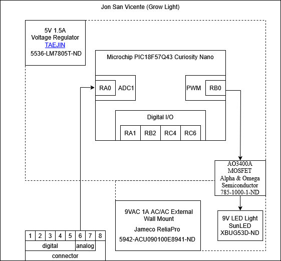

## Overview

The circuit will recieve a signal from a light sensor along pin 6 and, based on the recieved signal, will toggle a light and move shutters.
The circuit will run on 9v 2A with a voltage regulator converting to 5V 1.5A  for the Curiosity Nano.

## Block Diagram 

