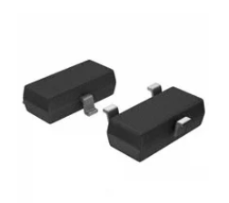
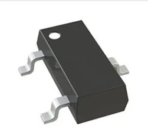
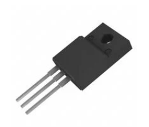
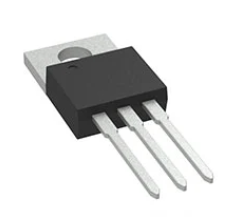
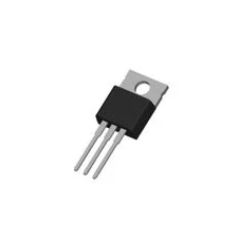
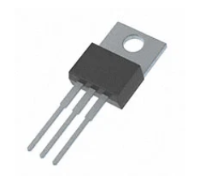
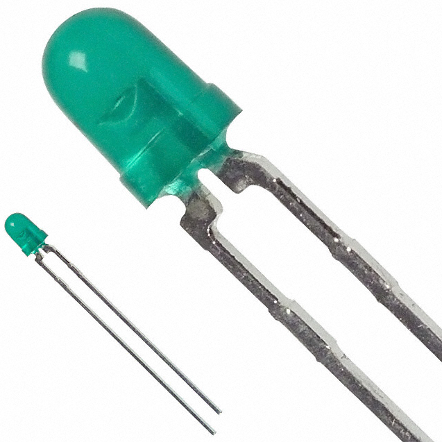
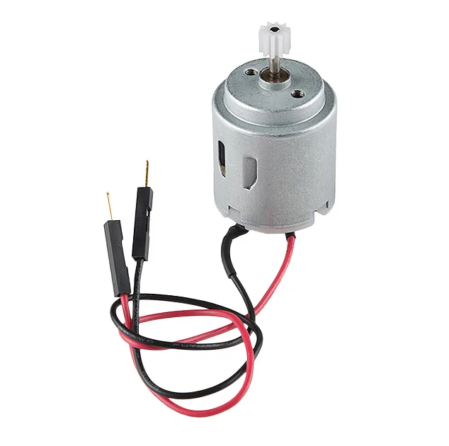
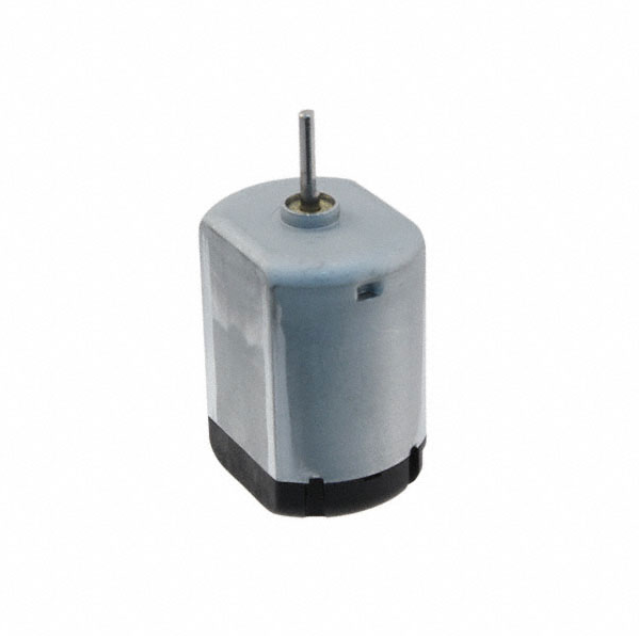

## MOSFET

| **Solution**                                                                                                                                                                                                                                                         | **Pros**                                                                             | **Cons**                                                                                            |
| ---------------------------------------------------------------------------------------------------------------------------------------------------------------------------------------------------------------------------------------------------------------------| -------------------------------------------------------------------------------------| --------------------------------------------------------------------------------------------------- |
|  Option 1.  N-Channel 60 V 200mA (Ta) 320mW (Ta) Surface Mount SOT-23-3 $0.13/each [Product Link](https://www.digikey.com/en/products/detail/toshiba-semiconductor-and-storage/T2N7002AK-LM/5298028)                        | \* Inexpensive \* Low profile                                                     | \* Less durable due to surface mount                                                                   |
|  \* Option 2.  \* N-Channel 60 V 115mA (Ta) 370mW (Ta) Surface Mount SOT-23-3  \* $0.14/each  \* [Product Link](https://www.digikey.com/en/products/detail/diodes-incorporated/2N7002-7-F/717681)                            | \* Inexpensive  \* Shorter shipping time                                          | * Less durable due to surface mount  \* Slow shipping speed                                         |
|  \* Option 3.  \* N-Channel 60 V 7A (Ta), 22A (Tc) 2.1W (Ta), 23.5W (Tc) Through Hole TO-220F  \* $1.66/each  \* [Product Link](https://www.digikey.com/en/products/detail/alpha-omega-semiconductor-inc/AOTF2618L/3603382)     | \* More durable through-hole connector  \* Larger operating temperature threshold | * More expensive                                                                                     

**Choice:** Option 3: N-Channel 60 V 7A (Ta), 22A (Tc) 2.1W (Ta), 23.5W (Tc) Through Hole TO-220F

**Rationale:** Through-hole connectors are easier to work with and are more durable than surface mounts.

## Voltage Regulator

| **Solution**                                                                                                                                                                                                                                                            | **Pros**                                                                             | **Cons**                                                                                            |
| ------------------------------------------------------------------------------------------------------------------------------------------------------------------------------------------------------------------------------------------------------------------------| -------------------------------------------------------------------------------------| --------------------------------------------------------------------------------------------------- |
|  Option 1.  Linear Voltage Regulator IC Positive Fixed 1 Output 1.5A TO-220-3L $1.80/each [Product Link](https://www.digikey.com/en/products/detail/texas-instruments/LM340T-5-0-NOPB/6237)                                      |                                                                                       | \* More expensive  \* Less features  \* Longer  shipping time                                 |
|  \* Option 2.  \* Linear Voltage Regulator IC Positive Fixed 1 Output 1.5A TO-220-3L  \* $0.33/each  \* [Product Link](https://www.digikey.com/en/products/detail/taejin/LM7805T/22237260)                                          | \* Inexpensive  \* Shorter shipping time  \* More features                     | * Massive shipping fee                                                                              |
|  \* Option 3.  \* Linear Voltage Regulator IC Positive Fixed 1 Output 1.5A TO-220AB  \* $0.34/each  \* [Product Link](https://www.digikey.com/en/products/detail/mcc-micro-commercial-components/MC7805CT-BP-HF/17949017)     | \* Inexpensive  \* More features                                                  | * Longer shipping time                                                                              |   

**Choice:** Option 2: Linear Voltage Regulator IC Positive Fixed 1 Output 1.5A TO-220-3L

**Rationale:** Cheapest option with the most features.   

## H-Bridge

| **Solution**                                                                                                                                                                                                                                                            | **Pros**                                                                             | **Cons**                                                                                            |
| ------------------------------------------------------------------------------------------------------------------------------------------------------------------------------------------------------------------------------------------------------------------------| -------------------------------------------------------------------------------------| --------------------------------------------------------------------------------------------------- |
|  Option 1.  L9110H H-BRIDGE 8DIP MOTOR DRIVE $1.50/each [Product Link](https://www.digikey.com/en/products/detail/adafruit-industries-llc/4489/11594498)                                                                                       | \* Smaller footprint                                                                 | \* More expensive                             |
|  \* Option 2.  \* BRUSH DC MOTOR CONTROLLER  \* $1.16/each  \* [Product Link](https://www.digikey.com/en/products/detail/rochester-electronics-llc/FAN8100N/11558200)                                                               | \* Inexpensive  \* Shorter shipping time  \*                                   | \* Massive shipping fee                                                                              |
 
**Choice:** Option 2: BRUSH DC MOTOR CONTROLLER

**Rationale:** Cheaper option that fulfils requirements.   

## LED

| **Solution**                                                                                                                                                                                                                                                            | **Pros**                                                                             | **Cons**                                                                                            |
| ------------------------------------------------------------------------------------------------------------------------------------------------------------------------------------------------------------------------------------------------------------------------| -------------------------------------------------------------------------------------| --------------------------------------------------------------------------------------------------- |
|  Option 1.  LED GREEN DIFFUSED T-1 3/4 T/H $1.10/each [Product Link](https://www.digikey.com/en/products/detail/sunled/XBUG53D/4901580)                                                                                                     | \* Higher forward voltage                                                            | \* Slightly more expensive                                                                          |
|  \* Option 2.  \* LED GREEN DIFFUSED T-1 T/H  \* $1.05/each  \* [Product Link](https://www.digikey.com/en/products/detail/broadcom-limited/HLMP-1640/637570)                                                                              | \* Slightly cheaper                                                                  | \* Lower forward voltage                                                                            |
 
**Choice:** Option 1: LED GREEN DIFFUSED T-1 3/4 T/H

**Rationale:** Higher forward voltage.   

## DC Motor

| **Solution**                                                                                                                                                                                                                                                            | **Pros**                                                                             | **Cons**                                                                                            |
| ------------------------------------------------------------------------------------------------------------------------------------------------------------------------------------------------------------------------------------------------------------------------| -------------------------------------------------------------------------------------| --------------------------------------------------------------------------------------------------- |
|  Option 1.  STANDARD MOTOR 6600 RPM 12V $2.75/each [Product Link](https://www.digikey.com/en/products/detail/sparkfun-electronics/11696/6163657)                                                                                              | \* Cheaper                                                                           | \* Lower RPM                                                                                        |
|  \* Option 2.  \* STANDARD MOTOR 12850 RPM 12V  \* $5.22/each  \* [Product Link](https://www.digikey.com/en/products/detail/nmb-technologies-corporation/PAN14EE12AA1/2417070)                                                         | \* Higher RPM                                                                        | \* More  expensive                                                                                  |
 
**Choice:** Option 1: STANDARD MOTOR 6600 RPM 12V

**Rationale:** Higher RPM unnecessary, cheaper cost is prioritized.