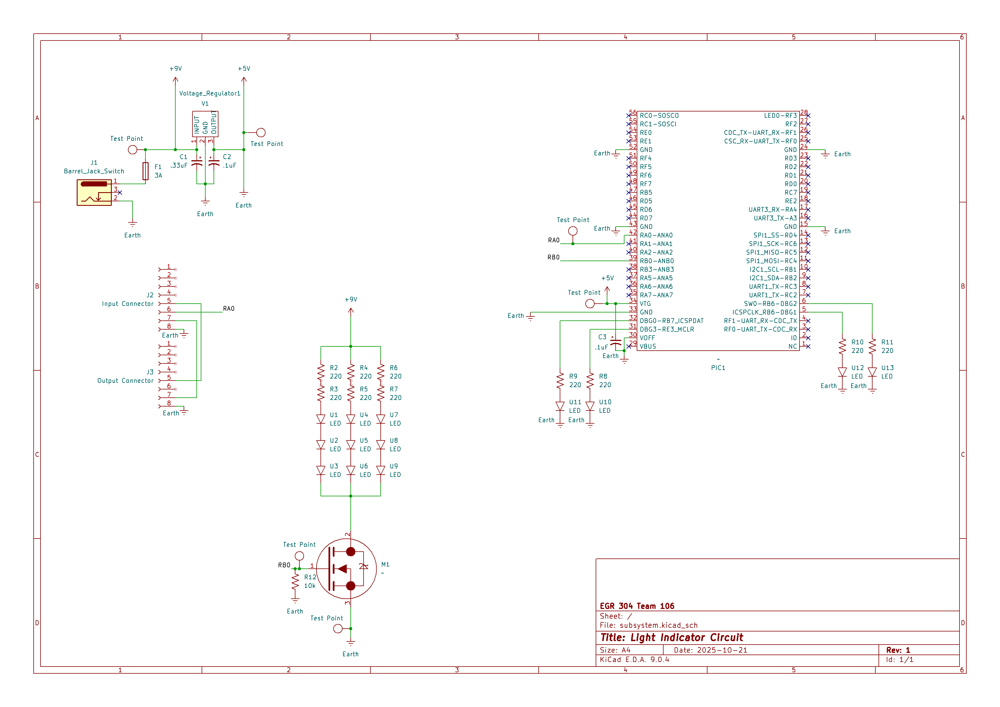

## Overview

This schematic is designed to recieve a signal from a connected light sensor and depending on the signal recieved, turn on or off an LED grow light or move some shutter blades.

{style width:"350" height:"300;"}

## Resouces

The schematic as a PDF download is available [*here*](subsystem.pdf), and the Zip folder of the project [*here*](subsystem.zip).