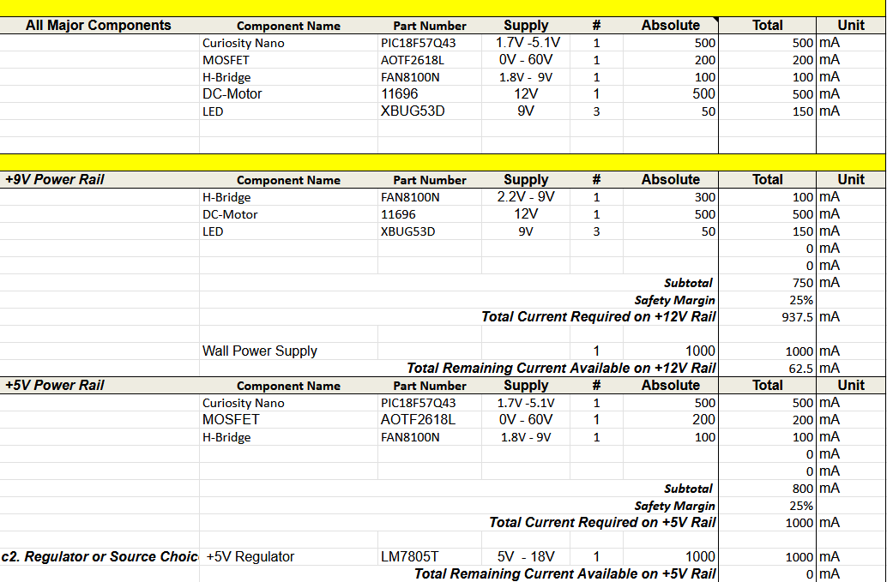

## Overview
This power budget outlines the power usage across the circuit and aims to make sure the circuit has enough to operate.

{style width:"350" height:"300;"}

{style width:"350" height:"300;"}

## Conclusions

The power budget shows that the circuit is able to operate at full capacity using the current power supply systems.

## Resouces

The power budget as a PDF download is available [*here*](Power Budget.pdf), and a Microsoft Excel Sheet [*here*](Power Budget.xlsx).